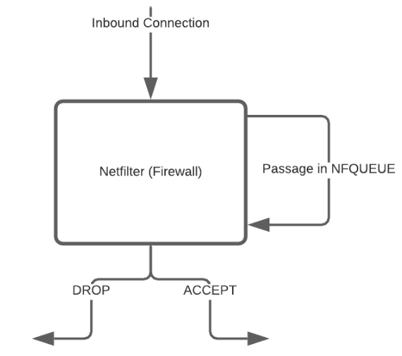

# OSIRIS
Projet crée suite à une demande d'un script en Python de la part de mon professeur de Sécurité de Système Avancée au sein de l'École Supérieure de Génie Informatique.

Le script est écrit en Python 3, il utilise les librairies : 
- Scapy : Pour la manipulation de paquet.
- Netfilterqueue : Pour le filtrage des paquets en utilisant le Firewall Netfilter et l'option Queue afin de mettre ces derniers en attente le temps d'une décision.

  

Actuellement une action manuelle de la part d'un utilisateur est nécessaire afin de filtrer les paquets un à un. 
Des whitelist / blacklist sont mises en place afin de ne pas avoir de demandes d'actions à un utilisateur sur des paquets deja traités.

TO DO :
- Implémenter une API axée Cyber Threat Intelligence afin d'effectuer le filtrage de façon automatique en fonction d'un IOC existant ou non sur l'adresse IP distante (IP d'un C2, IP utilisée dans le cadre d'une campagne malveillante...)
- Mise en place de threads afin de traiter les paquets sur plusieurs Queue.
- Mise en place d'une interface Graphique.
